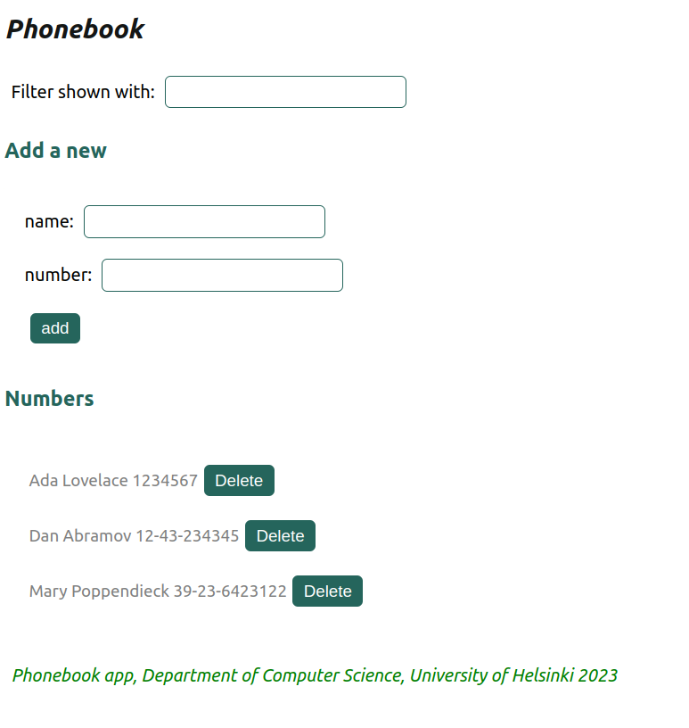

## Getting Started with Create React App

### npm start

## Define an alternate port, such as port 3001, for the json-server. The --watch option automatically looks for any saved changes to db.json

### npx json-server --port 3001 --watch db.json

